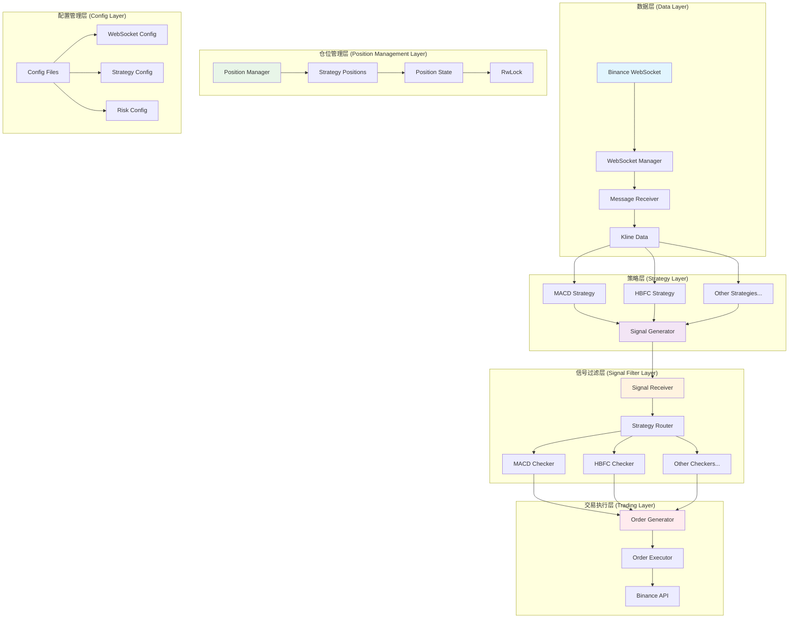
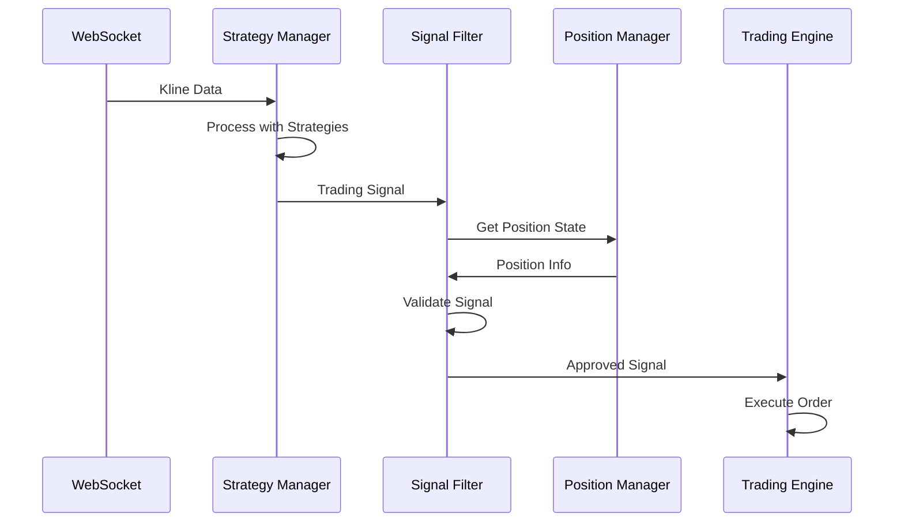

# Rust Trading System

一个基于 Rust 构建的高性能量化交易系统，支持实时市场数据处理、多策略信号生成和智能信号过滤。

## 系统架构



## 核心组件

### 1. 数据层 (Data Layer)
- **Binance WebSocket**: 实时市场数据源
- **WebSocket Manager**: 管理多个 WebSocket 连接
- **Message Receiver**: 接收和分发市场数据

### 2. 策略层 (Strategy Layer)
- **MACD Strategy**: 基于 MACD 指标的交易策略
- **HBFC Strategy**: 基于 HBFC 指标的交易策略
- **Signal Generator**: 生成原始交易信号

### 3. 信号过滤层 (Signal Filter Layer)
- **Signal Receiver**: 接收来自策略层的信号
- **Strategy Router**: 根据策略 ID 路由信号
- **Strategy Checker**: 策略特定的信号验证器

### 4. 仓位管理层 (Position Management Layer)
- **Position Manager**: 管理所有策略的仓位状态
- **Strategy Positions**: 每个策略的独立仓位
- **Position State**: 使用 RwLock 保证并发安全

### 5. 交易执行层 (Trading Layer)
- **Order Generator**: 生成交易订单
- **Order Executor**: 执行交易订单
- **Binance API**: 与交易所交互

## 数据流



## 关键特性

### 1. 分层架构
- **计算与过滤分离**: 策略层专注于信号生成，过滤层处理业务逻辑
- **事件驱动**: 基于消息的异步处理架构
- **模块化设计**: 易于添加新策略和过滤器

### 2. 并发安全
- **RwLock 保护**: 仓位状态使用读写锁保证并发安全
- **原子操作**: 关键数值使用原子操作
- **异步处理**: 基于 tokio 的异步运行时

### 3. 信号过滤机制
- **时间过滤**: 防止信号过于频繁
- **仓位过滤**: 基于当前仓位状态验证信号
- **风险过滤**: 动态风险控制
- **策略特定过滤**: 每个策略可以有自己的过滤规则

### 4. 可扩展性
- **策略枚举**: 支持动态添加新策略
- **检查器模式**: 可组合的信号验证器
- **配置驱动**: 通过配置文件控制行为

## 项目结构

```
rust_system/
├── src/
│   ├── bin/                    # 二进制程序
│   │   ├── macd_test.rs       # MACD 策略测试
│   │   └── strategy_manager_test.rs
│   ├── common/                 # 公共模块
│   │   ├── signal.rs          # 信号定义
│   │   ├── config/            # 配置管理
│   │   └── ts.rs              # 时间序列相关
│   ├── strategy/               # 策略模块
│   │   ├── common.rs          # 策略公共组件
│   │   ├── macd.rs            # MACD 策略
│   │   └── hbfc.rs            # HBFC 策略
│   ├── exchange_api/          # 交易所 API
│   │   └── binance/           # 币安 API
│   └── dto/                   # 数据传输对象
└── Cargo.toml
```

## 快速开始

### 1. 运行 MACD 策略测试
```bash
cargo run --bin macd_test
```

### 2. 运行策略管理器测试
```bash
cargo run --bin strategy_manager_test
```

### 3. 运行单元测试
```bash
cargo test
```

## 配置说明

### WebSocket 配置
```toml
[websocket]
auto_reconnect = true
max_retries = 5
retry_delay_secs = 5
connection_timeout_secs = 10
```

### 策略配置
```toml
[strategy.macd]
fast_period = 12
slow_period = 26
signal_period = 9
```

## 开发计划

- [ ] 实现信号过滤层
- [ ] 添加仓位管理
- [ ] 集成交易执行
- [ ] 添加风险管理
- [ ] 实现回测系统
- [ ] 添加性能监控

## 贡献指南

1. Fork 项目
2. 创建特性分支
3. 提交更改
4. 推送到分支
5. 创建 Pull Request

## 许可证

MIT License
